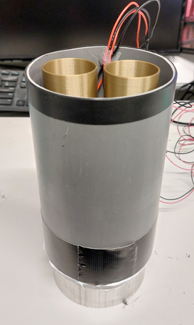
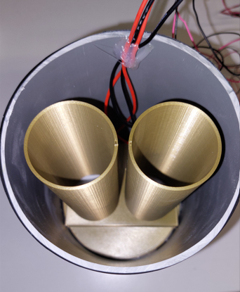
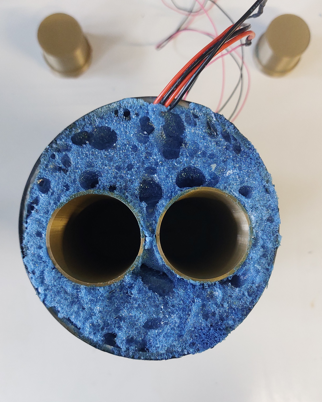
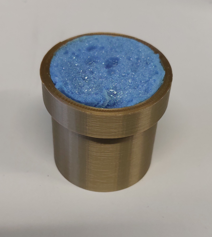
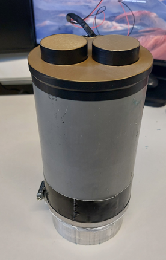
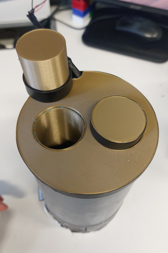

Assembling the calorimetric cells is quite straight forward once you have all the components: Peltier cells, aluminium bloc (heat sink), thermal conductive paste, 3D printed channels separator and PVC tube.
### Assembly steps:

1. **Place Peltier cells:** First, place the Peltier cells onto the aluminium block with thermal conductive paste at the interface between the aluminium and peltier cells.

2. **Channels separator:** Then, place the channels separator; you can hot glue it to the aluminium block to ensure it won't move.

3. **PVC tube:** After that, place the PVC tube and pass the cables out from the top of the PVC tube.

4. **Water tightness:** Now the cell needs to be water-tight from under; for that, place tightning collars around the PVC tube to firmly clamp it to the block; you can then tape the PVC tube to the aluminium block to create a temporary water-tight-ish assembly. Then poor liquide silicone in the small gap between the tube and block; when it hardens it will be fully water-tight.

5. **Isolating foam:** You can now spray isolating foam all around the PVC tube and channels separator. Choose a foam adapted for moist environments.

6. **Foam cutting:** Once the foam has hardened, you can cut the exceedent, revealing your calorimetric channels.

7. **Lids preparation:** Do the same procedure for the channel lids.

8. **Congrats:** Enjoy your DIY-made calorimetric cell! Congrats!
 

